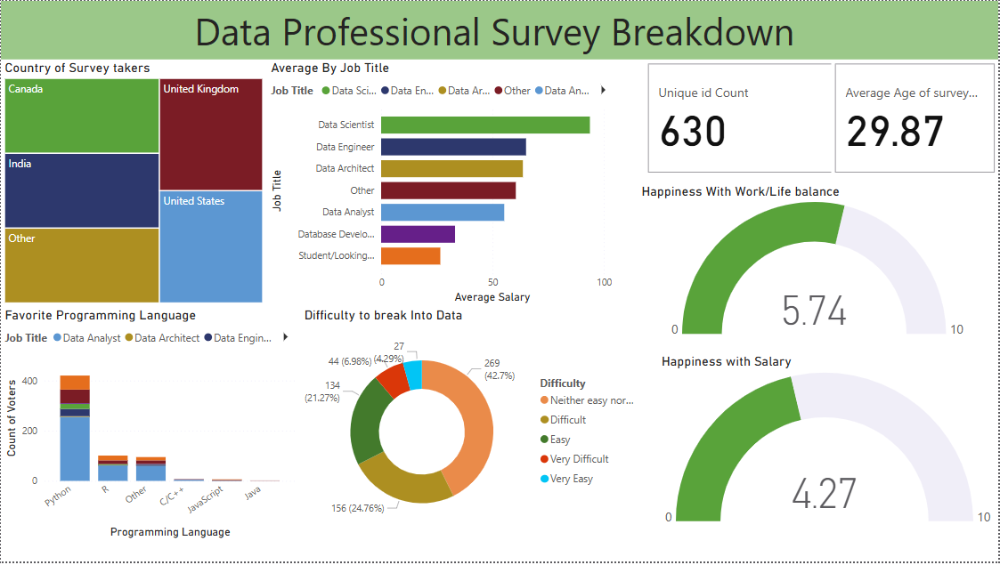

# Data Professional Survey Dashboard

An interactive Power BI dashboard visualizing trends among 630+ data professionals across the United States, Canada, India, and the United Kingdom.

## 🖼 Dashboard Preview

## 📊 Key Insights
- Salary breakdown by job title (Data Scientist, Data Analyst, Engineer, Architect)
- Favorite programming languages (Python, R, SQL)
- Work-life balance and salary satisfaction scores
- Difficulty levels faced while entering the data industry
- Country-wise survey distribution

## ⚙️ Tools & Technologies
- Power BI
- DAX
- Data Modeling
- Data Visualization

## 📂 Project Files
- `Data_Professional_Survey.pbix` - Power BI Dashboard file
- `screenshot.png` - Dashboard image preview

## 🚀 About This Project
This dashboard provides insights into career paths, salaries, and skill preferences in the data industry. Built using Power BI’s interactive visualizations and DAX measures.

---
"# data-professional-survey-dashboard" 
